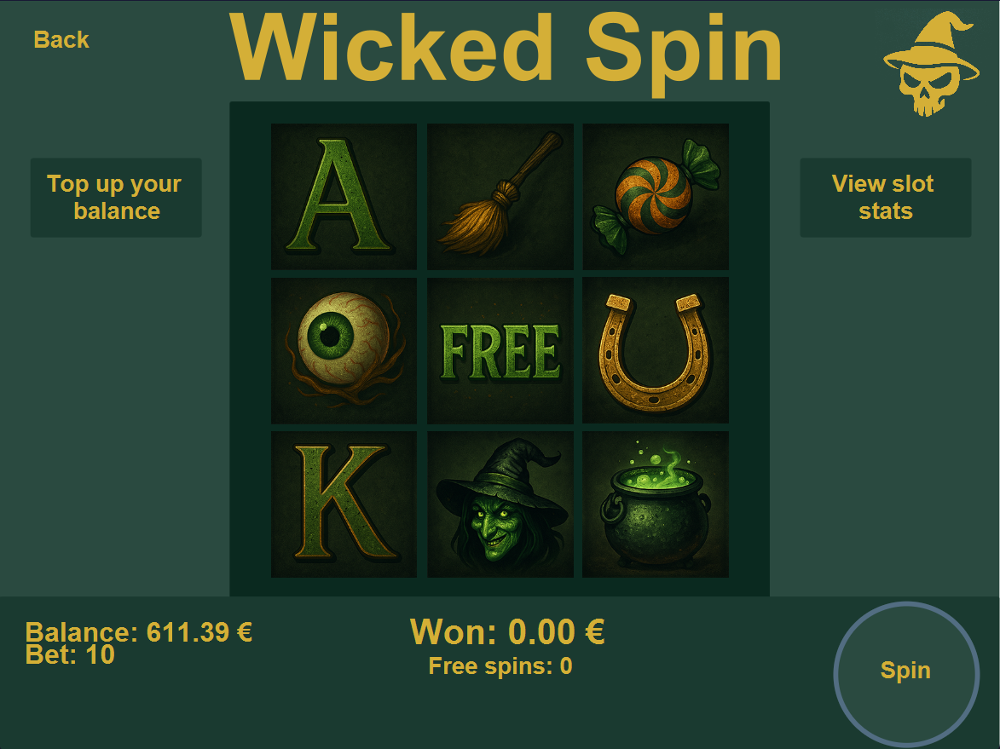
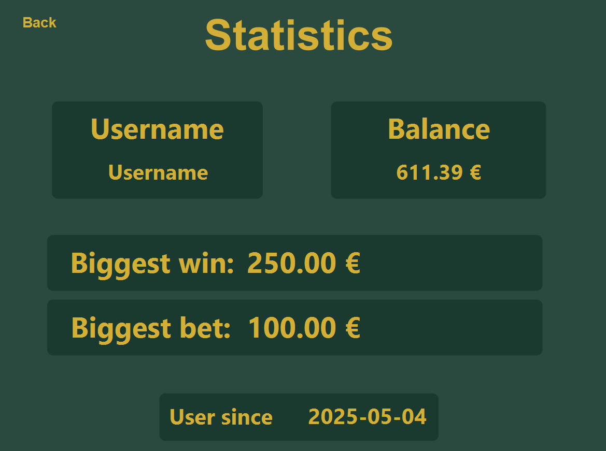

# Wicked Bet - Bezriska Desktop Kazino 🎰

**Wicked Bet** ir bezriska kazino slots aparāts, kurā spēlētāji izmanto neīstu naudu, ko paši pievieno savam kontam. Ideāli piemērots tiem, kas vēlas izbaudīt spēļu automātu pieredzi bez riska vai reālām finanšu saistībām. Lietotājam pieejams animēts spēļu automāts, droša konta sistēma, statistika un draudzīgs dizains.

---

## 📜 Saturs
1. [Funkcijas](#-funkcijas)
2. [Attēli no aplikācijas](#-attēli-no-aplikācijas)
3. [Lietotāja ceļvedis](#-lietotāja-ceļvedis)
4. [Instalēšanas soļi](#-instalēšanas-soļi)
5. [Lapu apraksti](#-lapu-apraksti)
6. [Koda ieskats](#-koda-ieskats)
7. [Saites](#-saites)

---

## 📌 Funkcijas

- 💰 **Maināmi likmju apjomi** – pielāgo savu spēles stratēģiju
- 🎁 **10 bezriska griezieni** – katram jaunam spēlētājam dāvana startam
- 📊 **Statistika** – apskati gan savu, gan kopējo aparāta statistiku
- 🔐 **Droša kontu sistēma** – reģistrēšanās un pieslēgšanās
- 🏆 **Leaderboards** – salīdzini savu veiksmi ar citiem spēlētājiem
- 🎞️ **Animēts aparāts** – dzīvīga un kustīga vizuālā pieredze
- 🧭 **Viegli saprotams dizains** – piemērots arī iesācējiem

---

## 🖼️ Attēli no aplikācijas

| Pieslēgšanās                                        | Spēle                                              | Statistika                                         |
|-----------------------------------------------------|----------------------------------------------------|----------------------------------------------------|
|   |  |  |


---

## 🧑‍💻 Lietotāja ceļvedis

1. Lejupielādē un palaid aplikāciju (skat. [Instalēšanas soļi](#-instalēšanas-soļi))
2. Izveido savu kontu vai pieslēdzies esošajam
3. Pievieno neīstu naudu savam kontam
4. Izvēlies likmi un sāc spēlēt, spiežot pogu **"Spin"**
5. Skaties statistiku, lai uzlabotu stratēģiju

## 🔧 Instalēšanas soļi

### 1. variants - Palaist projektu caur CLI

1. **Lejupielādē projektu**
    - Atver [Wicked Bet GitHub repozitoriju](https://github.com/23DP1NKris/Wicked_Bet) un lejupielādē ZIP failu.

2. **Atarhivē ZIP failu**
    - Ar peles labo taustiņu uzklikšķini uz lejupielādētā ZIP faila un izvēlies “Extract All...” uz sev vēlamo mapi.

3. **Instalē Java Development Kit (JDK)**
    - Pārliecinies, ka ir uzinstalēts vismaz JDK 17 vai jaunāka versija. Lejupielādei vari izmantot [Oracle JDK](https://www.oracle.com/java/technologies/java-se-glance.html) vai [OpenJDK](https://jdk.java.net/).

4. **Instalē Apache Maven**
    - Lejupielādē Maven no [Maven mājaslapas](https://maven.apache.org/download.cgi) un seko instrukcijām.

5. **Atver CLI**
    - Windows: atver Command Prompt
    - macOS/Linux: atver Terminal

6. **Nomaini direktoriju**
   ```bash
   cd <tava_izveleta_mape>/WickedBet
   ```
   
7. **Instalē projektu**
   ```bash
   mvn clean install
   ```
   
8. **Palaid aplikāciju**
   ```bash
   mvn javafx:run
   ```

### 2. variants – Palaist projektu ar koda redaktoru

1. **Lejupielādē projektu**
   - Atver [Wicked Bet GitHub repozitoriju](https://github.com/23DP1NKris/Wicked_Bet) un lejupielādē ZIP failu **vai** klonē repozitoriju:\
     `git clone https://github.com/23DP1NKris/Wicked_Bet.git`

2. **Atarhivē ZIP failu**
   - Ja lejupielādēji kā ZIP, atarhivē to sev vēlamajā mapē.

3. **Instalē nepieciešamos rīkus**:
   - **Java Development Kit (JDK)** – uzinstalē **JDK 17 vai jaunāku** versiju
      - [Oracle JDK](https://www.oracle.com/java/technologies/javase-downloads.html) vai [OpenJDK](https://jdk.java.net/)
   - **Koda redaktors** – iesakām kādu no šiem:
      - [IntelliJ IDEA (Community Edition)](https://www.jetbrains.com/idea/download/)
      - [Visual Studio Code](https://code.visualstudio.com/)
   - **Apache Maven** – nepieciešams, lai pārvaldītu dependencies un projektu
      - [Lejupielāde un instalācija](https://maven.apache.org/download.cgi)

4. **Atver projektu redaktorā**:

   #### IntelliJ IDEA:
   1. Atver IntelliJ
   2. Izvēlies **"Open"** un atver mapi `Wicked_Bet`
   3. IntelliJ automātiski atpazīs Maven projektu – ja nē, izvēlies **"Add as Maven Project"**
   4. Ļauj Maven lejupielādēt dependencies
   5. Lai palaistu aplikāciju:
      - Atver `Main.java` (atrodas `src/main/java/...`)
      - Ar peles labo taustiņu izvēlies **"Run Main.main()"**

   #### Visual Studio Code:
   1. Atver VS Code
   2. Atver mapi `WickedBet`
   3. Ja nepieciešams, instalē šos paplašinājumus:
      - Extension Pack for Java
      - Maven for Java
      - JavaFX Support
   4. Atver `Main.java` un klikšķini uz **"Run"** vai izmanto CLI, tajā rakstot **"Run Java"**
---

## 📄 Lapu apraksti

#### Sākumlapa
- Sākumlapā lietotājam ir dotas izvēles:
   - Iziet no aplikācijas, ja nav 18 - **"Exit"**
   - Ieiet aplikācijā, ja ir vismaz 18 - **"Enter"**

#### Pieslēgšanās
- Lietotājs var ieloties savā kontā, ievadot savu lietotājvārdu un paroli
- Ja nav konta, tad var izveidot jaunu kontu, klikšķinot uz "Register an Account"

#### Reģistrācija
- Lietotājs var izveidot savu kontu, ievadot unikālu lietotājvārdu un sevis izvēlētu paroli
- Ja jau ir konts, tad var aiziet atpakaļ uz log in sadaļu, klikšķinot uz **"Log in"**

#### Izvēlne - menu
- Lietotājs var izvēlēties starp spēli - **"Play Slots"**, statistiku - **"Statistics"** vai leaderboards - **"Leaderboards"**
- Ja ir vēlme iziet no sava konta, tad jākliķškina uz **"Log out"**

#### Spēle
- Lietotājs var spēlēt kazino aparātu spiežot pogu **"Spin"**
- Var mainīt **likmi**, klikšķinot uz **likmes vērtības**
- Var pievienot savam kontam naudu, klikšķinot uz **"Top up your balance"**
- Var apskatīt kopējo aparāta statistiku, klikšķinot uz **"View slot stats"**

#### Statistika
- Lietotājs var apskatīt savu statistiku - naudas daudzumu, lielāko likmi vai lielāko uzvarēto naudas summu -, kā arī konta datus: lietotājvardu un reģistrācijas datumu

#### Leaderboards
- Lietotājs var apskatīt visus reģistrētos lietotājus un viņu statistiku
- Lietotājus var kārtot, noklikšķnot uz tabulas galveni ("Biggest Bet" vai "Biggest Win"), lai tos kārtotu augošā vai dilstošā secībā.
- Lietotājus var filtrēt, izmantojot filtrus, kuros jāievada minimālās un maksimālās vērtības (visi lauki nav obligāti jāaizpilda) un spiežot **"Filter"**
- Lietotājus var meklēt, ievadot lietotājvārdu un spiežot **"Search"**

#### Papildināt naudas daudzumu
- Lietotājs atverot lapu var klikšķināt uz pogām, lai pievienotu naudas summas (piem. **"Add 10€", "Add 50€"**)
- Savu naudu var arī izdzēst (uzstādīt par 0), spiežot pogu **"Reset"**

#### Aparāta statistika
- Lietotājs var apskatīt aparāta kopējo statistiku - kopējo likmju un uzvarētās naudas daudzuma summas, kā arī kopējos griezienus _(Statistika tiek skaitīta no visiem lietotājiem)_


#### Vispārīgi
- Katrā lapā, lai tiktu uz iepriekšējo lapu ir jāklikšķina uz **"Back"**

---
## 🤖 Koda ieskats

#### Zemāk ir redzami koda piemēri no aplikācijas, dažādu funkciju veikšanai:

### Uzvarētā naudas apjoma aprēķins 
```java
   public BigDecimal calculateWin(BigDecimal bet, int[] reelStops, String[] symbols) {
      // makes all the slots into slot1, slot2, ..., slot9
      String slot1 = symbols[reelStops[0] % symbols.length];       // (1,1)
      String slot2 = symbols[reelStops[1] % symbols.length];       // (1,2)
      String slot3 = symbols[reelStops[2] % symbols.length];       // (1,3)
      String slot4 = symbols[(reelStops[0] + 1) % symbols.length]; // (2,1)
      String slot5 = symbols[(reelStops[1] + 1) % symbols.length]; // (2,2)
      String slot6 = symbols[(reelStops[2] + 1) % symbols.length]; // (2,3)
      String slot7 = symbols[(reelStops[0] + 2) % symbols.length]; // (3,1)
      String slot8 = symbols[(reelStops[1] + 2) % symbols.length]; // (3,2)
      String slot9 = symbols[(reelStops[2] + 2) % symbols.length]; // (3,3)
   
      if ((slot4.equals(slot5) && slot5.equals(slot6)) || (slot2.equals(slot5) && slot2.equals(slot8))) { // middle row or middle column
         win = bet.multiply(new BigDecimal(8));
      } else if ((slot1.equals(slot5) && slot5.equals(slot9)) || (slot3.equals(slot5) && slot5.equals(slot7))) {  // diagonals
         win = bet.multiply(new BigDecimal(5));
      } else if (slot1.equals(slot5) || slot3.equals(slot5) || slot7.equals(slot5) || slot9.equals(slot5)) {  // corner and middle slot
         win = bet.multiply(new BigDecimal("1.2"));
      } else if (slot4.equals(slot5) || slot5.equals(slot6) || slot4.equals(slot6)) { // one of two slots in the middle row
         win = bet.multiply(new BigDecimal("1.5"));
      } else {
         win = BigDecimal.ZERO; // resets the win back to 0 if none match
      }
   
      return win.setScale(2, RoundingMode.HALF_UP);
   }
```

### Likmes ievades validācija
```java
   public static boolean validInputs(String inputBet) { // checks if there aren't invalid symbols in the input
       return !Pattern.matches("^\\d+(\\.\\d{1,2})?$", inputBet);
   }
   
   public static boolean emptyInputs(String inputBet) { // checks if the input isn't empty
       return inputBet == null || inputBet.isEmpty();
   }
```

###### Pārējo kodu var atrast lejupielādētajā failā - lielākā daļa koda ir komentēta aplikācijas attīstīšanas vēlēšanās gadījumam jebkuram programmētājam.

---

## 🔗 Saites

- 📂 [Projekta fails - GitHub](https://github.com/23DP1NKris/Wicked_Bet)
- 🌐 [Mājaslapa](https://23dp1nkris.github.io/Wicked_Bet_website/)

---
###### Veidoja Nils Roberts Krištopāns un Adrians Vanags